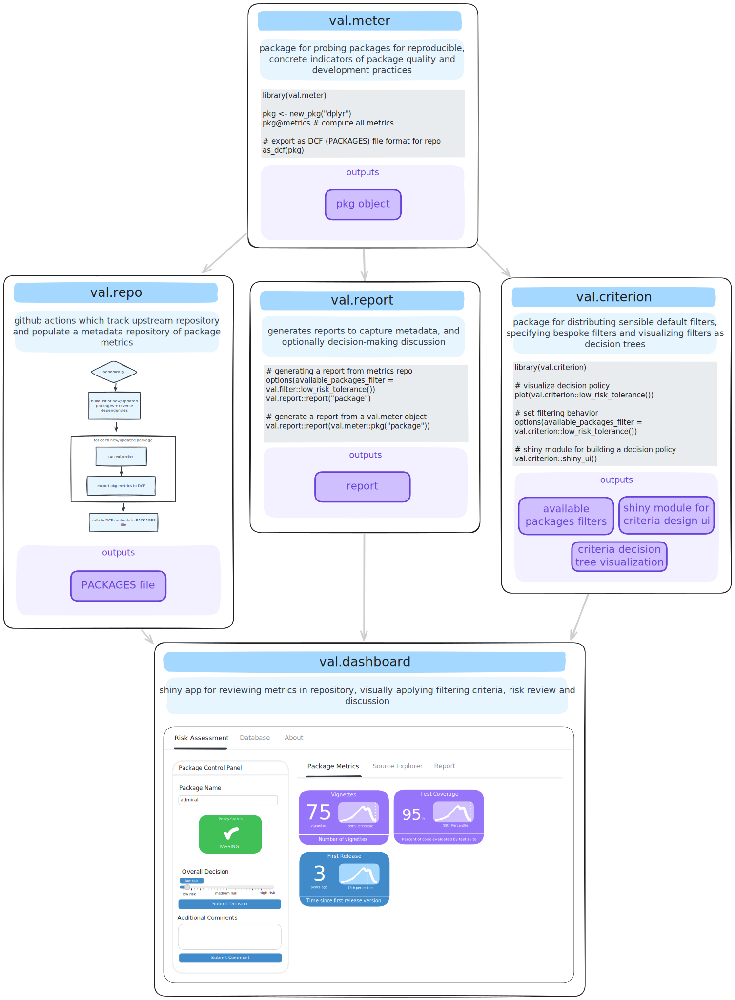

# Regulatory R Package Repository

This is the repository of the Regulatory R Package Repository Working Group of the R Validation Hub.

Our website: https://pharmar.github.io/regulatory-r-repo-wg

## Vision

Using R in submissions to healthcare regulators is challenging since the 
quality of any packages used must be ensured and evidence of ensuring this
quality must be made available on request. 
This working group strives to identify and prototype at least one technical
framework that can support a transparent, open, dynamic, cross-industry approach
of establishing and maintaining a 'repository' of R packages with
accompanying evidence of their quality and the assessment criteria, that can be used to simplify necessary
in-house validation processes as much as possible.
Such a cross-industry 'repository' could help with burden-sharing of
validation efforts, improve quality via transparent, open peer review, and
de-risk the use of public R packages for regulatory submissions.
We seek a pragmatic solution, ideally endorse by key regulators.
Even though we strive to keep the approach as open as possible, the initial
focus lies on the pharmaceutical industriy and their regulatory environment. 

## A new landscape for risk tools

Although nothing is finalized, our current vision for a modernized risk tools
landscape breaks down into a integrated suite of R infrastructure and packages:

## How to get involved

- Reply to our ["sign up" thread](https://github.com/pharmaR/regulatory-r-repo-wg/issues/1)
  to be contacted about planning meetings.
- Sign up for the [R Validation Hub mailing list](https://www.pharmar.org/contact/)
